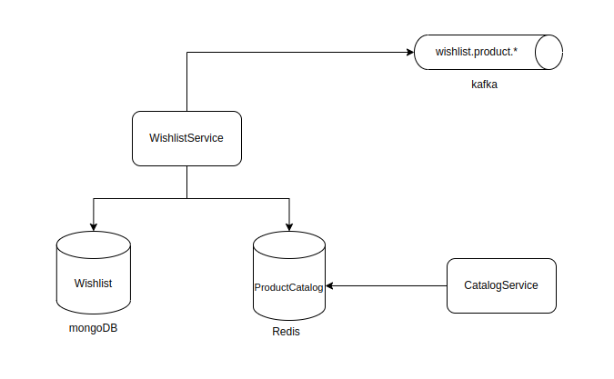

# System Design

## Wishlist tech stack:
- Java 17
- SpringBoot 3.1.0
- MongoDB
- Redis
- Kafka
- Docker 23.0.4
- Mongock
- RestAssured
- Testcontainers
- Mapstruct
- Maven 3.8.1

## Explanation on the tech stack    
- MongoDB
  - As the model is semi-structured, and may change at a fast pace, a noSQL Database makes most sense.
- Redis
  - This application makes user of caching to retrieve the products' details in order to have a fair data consistency (note that we're not trying to achieve strong data consistency).
- Kafka
  - Kafka is used to notify when an event that may be relevant to other services occur
- Docker
  - Docker plays an important role in mocking the production environment
- Mongock
  - Used to keep track of migrations, such as the userId index creation.
- ResAssured
  - Heavily used for contract testing.
- Testcontainers
  - We're using containers for integration tests as well. This enables the application to be tested as it were in production.
- Mapstruct
  - Used for mapping between classes

## Local Environment
- Go to the 'local' directory: `cd local`
- Execute the start script, to start the app: `./start.sh`
- To stop the app, simply execute: `./stop.sh`

##  Swagger
Simply go to `localhost:8080/swagger-ui.html` in order to check out the API contracts
